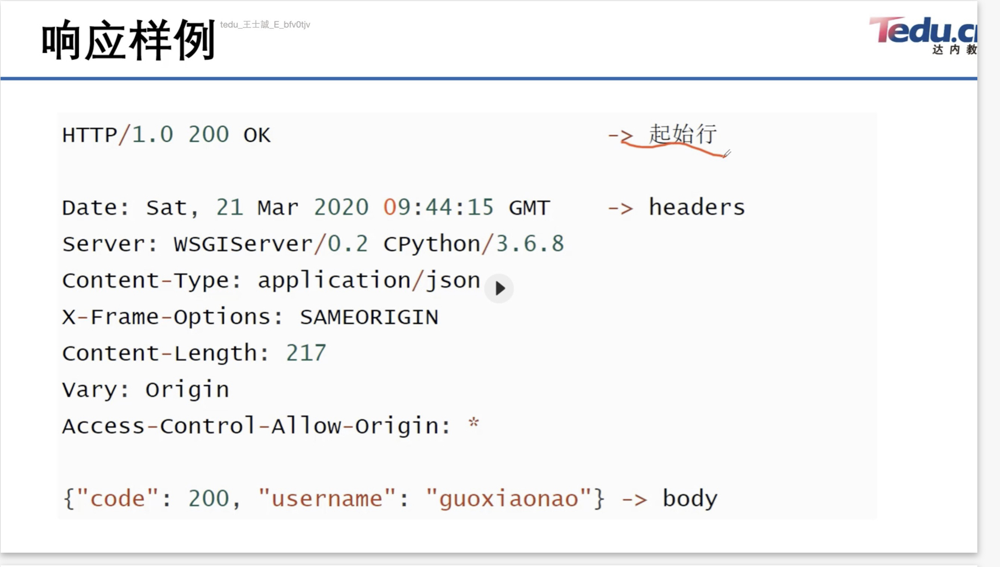
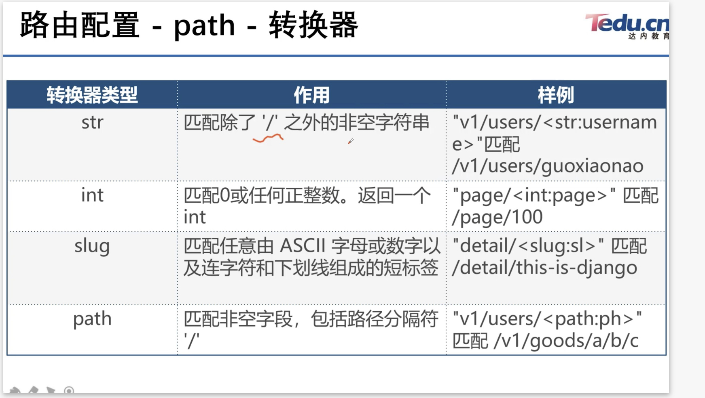
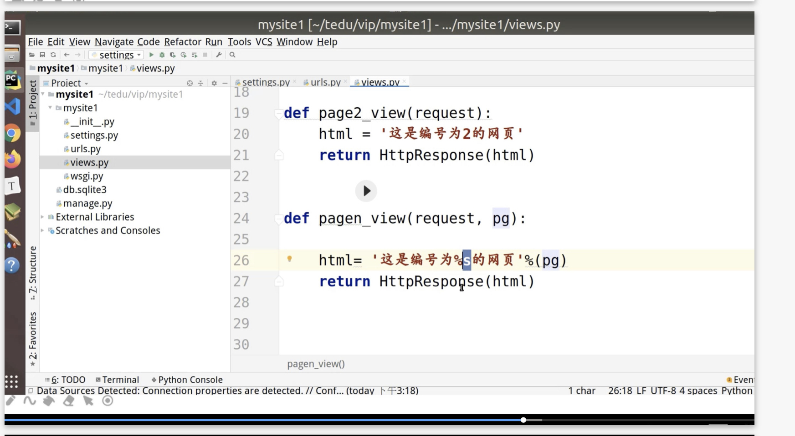
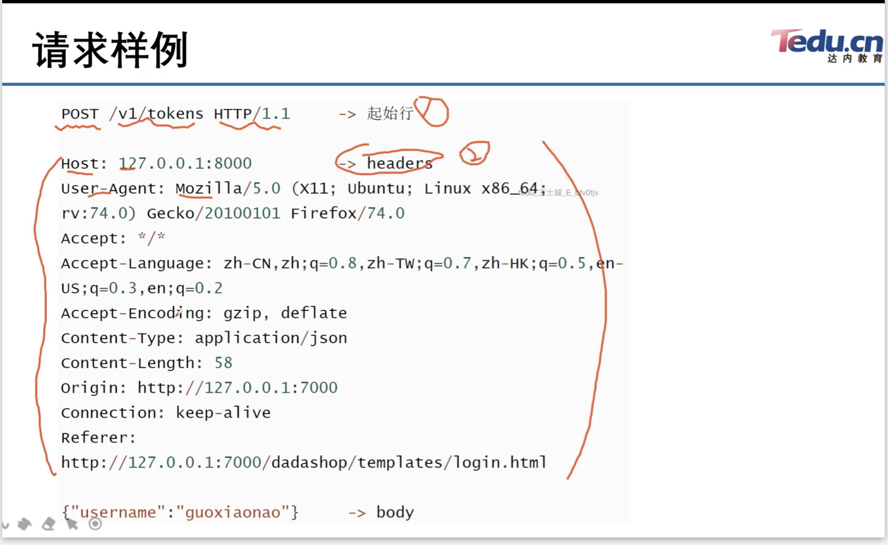
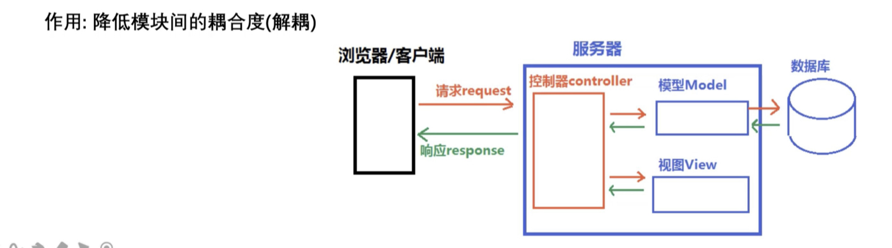
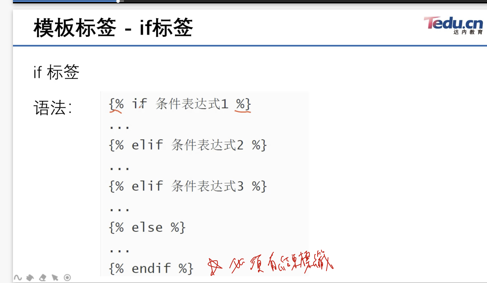
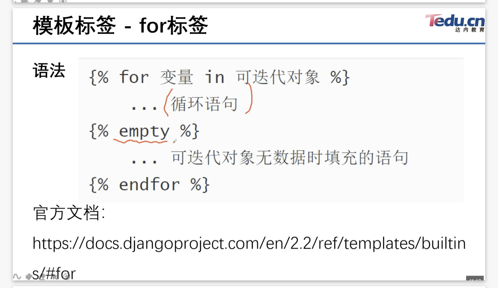

## Django介紹
安裝:
##
    sudo pip3 install django==2.2.12 (課程安裝2.2.12版本，我本機是用default)
    #檢查是否安裝
    sudo pip3 freeze|grep -i 'Django'
    #創建項目
    django-admin startproject projectname


### Django中的請求
- COOKIES: python中的字典，包含所有cookies，鍵和值都是字符串
- session: 類似字典的對象，代表當前的會話
- body:字符串，請求體內容(POST或PUT)
- scheme:請求協議(http/https)
- request.get_full_path():請求的完整路徑
- request.META:請求中的元數據(消息頭)
    request.META['REMOTE_ADDR']:客戶端IP位址


響應範例:



### 響應狀態碼
- 200 請求成功
- 301 永久重定向，資源網頁等，被永久轉移到其他URL
- 302 臨時重定向
- 404 請求的資源(網頁等)，不存在
- 500 伺服器錯誤

HTTP狀態碼由三個十進位數字組成，第一個數字定義了狀態碼類型，後兩數字沒有分類的作用，共分五種類型：
<table border="1" cellspacing="5">
        <tr>
            <td>分類</td>
            <td>分類描述</td>
        </tr>
        <tr>
            <td>1**</td>
            <td>伺服器有收到請求，需要請求者繼續執行操作</td>
        </tr>
        <tr>
            <td>2**</td>
            <td>成功，操作備成功接收並處理</td>
        </tr>
            <td>3**</td>
            <td>重定向。需進一步操作以完成請求</td>
        </tr>
        <tr>
            <td>4**</td>
            <td>客戶端錯誤，請求包含錯誤語法等</td>
        </tr>
        <tr>
            <td>5**</td>
            <td>伺服器錯誤，伺服器在處理請求過程發生錯誤</td>
        </tr>
</table>

### Django中的響應對象
構造函數格式:
HttpResponse(content=響應體, content_type=響應數據類型,status = 狀態碼)
作用：
向客戶端瀏覽器返回響應，同時攜帶響應體內容。

常見content_type:
- 'text/html' 默認的，html文件
- 'text/plain'  純文本
- 'text/css'    css文件
- 'text/javascript'    javascript文件
- 'multipart/form-data' 文件提交
- 'application/json'    json傳輸
- 'application/xml' xml文件

HttpResponse子類:
<table border="1" cellspacing="5">
        <tr>
            <td>類型</td>
            <td>作用</td>
            <td>狀態碼</td>
        </tr>
        <tr>
            <td>HttpResponseRedirect</td>
            <td>重定向</td>
            <td>302</td>
        </tr>
        <tr>
            <td>HttpResponseNotModified</td>
            <td>未修改</td>
            <td>304</td>
        </tr>
            <td>HttpResponseBadRequest</td>
            <td>錯誤請球</td>
            <td>400</td>
        </tr>
        <tr>
            <td>HttpResponseNotFound</td>
            <td>沒有對應的資源</td>
            <td>404</td>
        </tr>
        <tr>
            <td>HttpResponseForbidden</td>
            <td>請求被禁止</td>
            <td>403</td>
        </tr>
              <tr>
            <td>HttpResponseServerError</td>
            <td>伺服器錯誤</td>
            <td>500</td>
        </tr>
</table>


### 視圖函數
views.py
##
    from django.http import HttpResponse
    def page1_view(request):
        html = "<h1>First Page</h1>"
        return HttpResponse(html)

### 路由配置

settings.py中的`ROOT_URLCONF`指定了主路由配置列表urlpatterns的文件配置

##
    urlpatterns = [
        path('page/2003/' , views.page_2003_view),
        ##配置路由
    ]
- path函數
##
    from django.urls import path
    path(route, views , name=None)
- parameters
  1. route字符串，匹配的請求路徑
  2. views指定路徑所對應的視圖處理函數名稱
  3. name為地址起別名，在模板中地址反向解析時使用
   

- 路由轉換器
語法：<轉換器類型:自定義名>
作用:若轉換器匹配到對應類型的數據，則將數據案找`關鍵字傳參`方式遞交給視圖函數
ex:
##
    path('page/<int:page>' , views.xxx)




- re_path()
  在url的匹配過程中可以使用正則表達式進行精確匹配

  語法：
  ##
    re_path(reg , view , name= xxx)

正則表達式為命名分組模式(?P< name >pattern),匹配提取參數後用關鍵字傳參給視圖函數。


### 請求及響應
定義:
- 請求是指瀏覽器端透過HTTP協議發送給server的數據
- 響應是指server接收到請求後，作出相應的處理後回覆給瀏覽器端的數據



不同的請求方法(HTTP1.0):

 <table border="1" cellspacing="5">
        <tr>
            <td>index</td>
            <td>方法</td>
            <td>描述</td>
        </tr>
        <tr>
            <td>1</td>
            <td>GET</td>
            <td>請求指定的頁面訊息，並返回實體主體</td>
        </tr>
        <tr>
            <td>2</td>
            <td>HEAD</td>
            <td>類似get請求，但返回的數據沒有具體內容，用於獲取請求頭</td>
        </tr>
            <td>3</td>
            <td>POST</td>
            <td>向指定資源提交數據並進行處理請求(ex:表單提交或上傳文件)，數據被包在請求體中，POST請求可能會導致新資源的建立或是已有資源的修改。
            </td>
        </tr>
</table>

HTTP1.1新增

 <table border="1" cellspacing="5">
        <tr>
            <td>index</td>
            <td>方法</td>
            <td>描述</td>
        </tr>
        <tr>
            <td>1</td>
            <td>PUT</td>
            <td>從客戶端向server傳送的數據取代指定的文檔內容。</td>
        </tr>
        <tr>
            <td>2</td>
            <td>DELETE</td>
            <td>請求server刪除指定頁面。</td>
        </tr>
            <td>3</td>
            <td>CONNECT</td>
            <td>HTTP/1.1協議中預留能夠將連接管道方式的代理伺服器。
            </td>
        </tr>
        </tr>
            <td>4</td>
            <td>OPTIONS</td>
            <td>允許客戶端查看server性能。
            </td>
        </tr>
        </tr>
            <td>5</td>
            <td>TRACE</td>
            <td>回傳server收到的請求，主要用於測試和除錯。
            </td>
        </tr>
</table>


### Django中的請求
請求在Django就是視圖函數(views.py)中的第一個參數，即HttpRequest對象。
Django接收到Http協議的請求後，會根據請求數據回傳報文(請求頭, 請求體)創建HttpRequest對象，HttpRequest對象變根據屬性描述了請求的所有相關資訊。

- path_info : URL字串
- method: 字符串，表示HTTP請求方式，常用如'GET' , 'POST'
- GET: QueryDict(類字典)查詢字典的對象，包含get請求方式的的所有數據。
- POST: QueryDict，包含post請求方式的的所有數據。
- FILES: 類似於字典的對象，包含所有上傳文件的訊息。

無論是GET還是POST，統一由試圖函數接收請求，通過判斷request.method區分具體請求動作。

example:
##
    if request.method == 'GET':
    處理GET請求的邏輯
    elif request.method == 'POST':
    處理POST請求
    else:
        處理其他邏輯


### GET 處理
  GET請求動作，一般用於向server獲取數據。

- 使用GET請求的場景：
  a. 瀏覽器地址欄輸入URL，按enter後。

  b. < a href="地址?參數=值&參數=值>

  c. form表單中的method為get


GET請求中，通常以查詢字符串傳遞資訊給server，(注意不要傳遞隱私資訊)
URL格式ex: http://127.0.0.1:8080/page1?a=100&b=200
方法案例:

##
    request.GET['參數名']
    request.GET.get('參數名' , '默認值') ##較溫柔，可以給default
    request.GET.getlist('參數名') ##在查詢字符串中，可能有相同key，使用list全部調出，場景ex:一個人有多種興趣，一key配多value


### Post處理
Post請求動作一班用於向server提交大量/隱私數據。客戶端可透過表單等post請求將數據提交給server，ex:
##
    <form method="post" action='/login'>
        姓名:<input type="text" name="username">
        <input type="submit" value="登錄">
    </form>

- 使用post方式接收客戶端數據：
  參數名是根據html中的name屬性決定
  request.POST['參數名']
  request.POST.get['參數名','']
  request.POST.getlist['參數名']
  * 記得取消csrf驗證(settings.py)，否則django會拒絕客戶端發來的post請求，報403error。
  

### MVC架構
MVC代表Model-View-Controller(模型-視圖-控制器)
- M模型層，主要用於對數據庫層的封裝
- V視圖層，主要用於向用戶展示結果(What + How)
- C控制(Controller，用於處理請求，獲取數據並返回結果)




什麼是模板？
a. 模板是可以根據字典數據動態變化的html網頁。
b. 模板可以根據試圖中傳遞的字典數據動態生成相應的HTML頁面。


### 模板配置步驟
創建文件夾templates(項目目錄下)
配置settings.py文件:
##
    BACKEND:指定模板的引擎(預設django.template.backends.django.DjangoTemplates，依目前所學不用改)。
    DIRS:模板的搜索目錄，可以一個或多個。
    APP_DIRS:是否在應用蒸的templates文件夾搜索模板文件(True)
    OPTIONS:其他有關模板的選想(目前還沒詳細學)

    設置DIRS : 'DIRS':[os.path.join(BASE_DIR, 'templates')]

### 模板加載方式
一，通過loader獲取模板，再通過HttpResponse做響應。
##
    from django.template import loader
    #通過loader加載模板
    t = loader.get_template('模板文件名')
    html = t.render(字典數據)
    return HttpResponse(html)

視圖層與模板層之間的交互
- 視圖函數可以將python變量封裝到字典裡傳遞到模板。
  example:
##
    def xxx_views(request):
        dict = {
            "變量1":"值1",
            "變量2":"值2",
        }
        return render(request, 'xxx.html', dict)
    
到了模板中，我們可以使用{{變量名}}的語法調用視圖傳進來的變量。

example:
##
    def test_dict(request):
    dic = {
        'a': 1,
        'b': 2,
        'c': 3,
    }
    return render(request , 'test_dic.html' , dic)

    ================================================================
    #html
    <body>
    Hi
    {{a}}是1
    </body> 

    #頁面會顯示"Hi 1是1"

可使用的模板變量

str - 字符串
int - 整數
list - 數組
tuple - 元組
dict - 字典
func - 方法
obj - 類實例化的對象

在模板中的用法:
{{ 變量名 }}
{{ 變量名.index }}
{{ 變量名.key }}
{{ 對象.方法 }}
{{ 函數名 }}

另外，可使用locals()，這個功能會幫我們自動封裝目前有的變量成為一個字典，舉例，
目前程式
##
    x = request.POST['x']
    y = request.POST['y']
    op = request.POST['op']
    #這邊locals(即表示 dic = {'x': x, 'y': y , 'op': op})
    return render(request,'test.html' , locals())
### 模板標籤

將一些服務端的功能鑲嵌到模板中，例如流程控制等。
語法:
##  
    
    ...
    ...
    ...
    

範例(if語句)
<div style="width:500px; height:200px">





</div>

<br>
<br>
<br>
<br>
<br>
<br>
<br>
<br>
<br>
<br>
<br>
<br>
<br>
<br>
<br>
<br>
<br>
<br>


### 模板過濾器
在變量輸出時對變量的值進行處理，可以透過模板過濾器改變變量輸出的顯示。
##
    {{ 變量|過濾器1:'參數值1'|過濾器2:'參數值2' ... }}

### 模板的繼承
模板繼承可以使父模板的內容重用，子模板直接繼承父模板的全部內容並可以覆蓋父模板中的相應塊。   

重寫及覆蓋規則
- 不重寫：按照父模板效果顯示。
- 重寫:按照重寫效果顯示。


## URL
模板中html可能出現的位置
1. 模板html中

    a.點擊後跳轉至url
```
<a href = 'url' method = 'post'>
```

    b.form表單數據用post分法提交至url
```
<form action='url' method='post'>
```

2. 視圖函數 302跳轉 HttpResponseRedirect('url')
   將用戶地址欄中的地址跳轉到url


### url 規範
1. 絕對地址
```
http://127.0.0.1:8080/page/1
```

2. 相對地址
```
1. '/page/1'
'/'開頭的相對地址，瀏覽器會自動把當前地址欄裡的協議，ip和端口加上這個地址，作為最終訪問地址。

2. 'page/1'
沒有'/'開頭的相對地址，瀏覽器會根據前url的最後一個/之前的內容加上該相對地址，例如，當前地址為 http://127.0.0.1:8000/topic/detail;則該相對地址最終結果為 http://127.0.0.1:8000/topic/ + page/1

```

### url反向解析
url反向解析是在視圖或是模板層，用path定義的名稱來動態找尋或計算出相應的路由。
path語法
##
    path(route , views , name='別名')
    path('page' , views.page_view , name='page_url')


## 分布式路由
django 利用應用(app)達到分布式路由目標，應用在django項目中是一個獨立的業務模塊，一個應用能包含自己的視圖，模板及模型。

重要步驟:
a. python3 manage.py startapp 應用名
b. 在setting.py的INSTALL_APPS列表配置安裝此應用