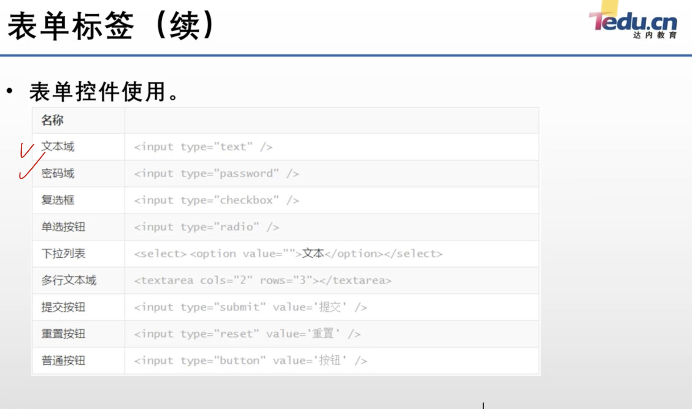
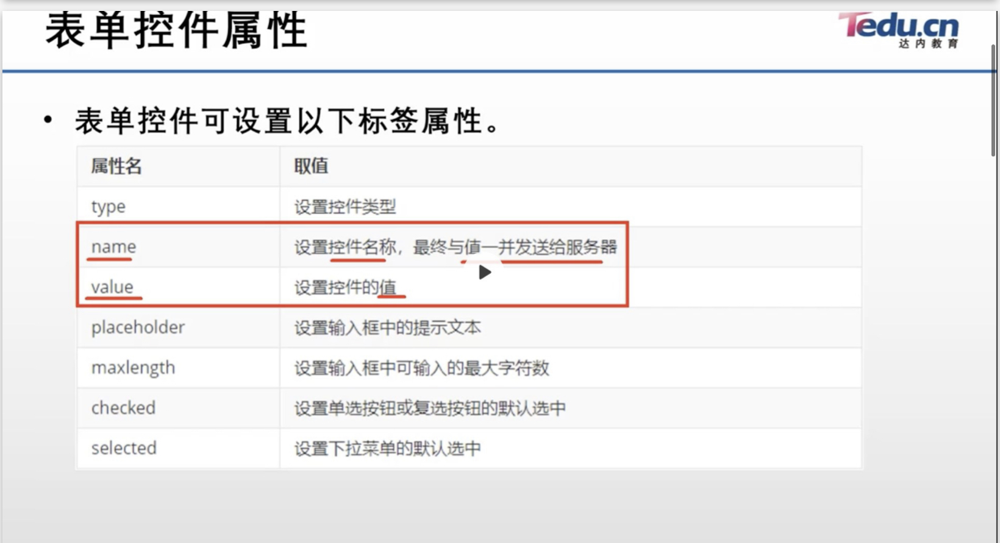
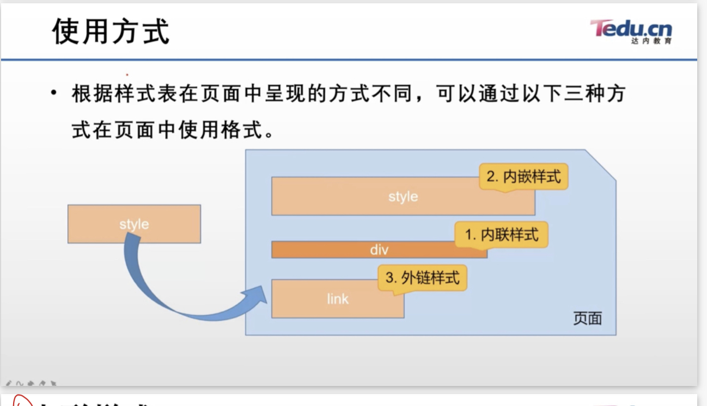
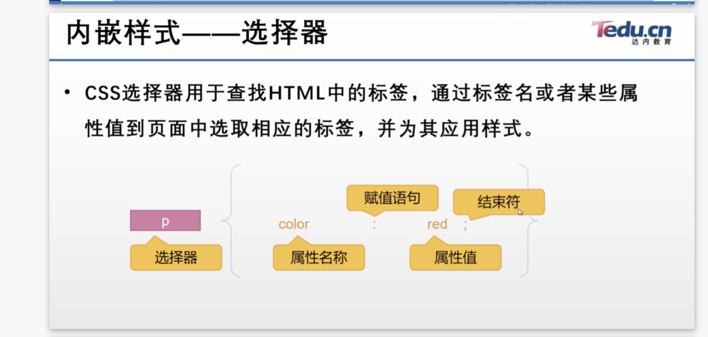
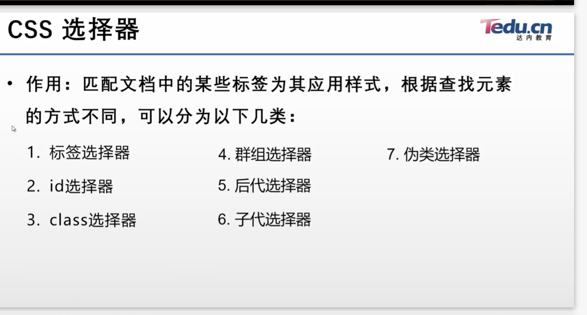
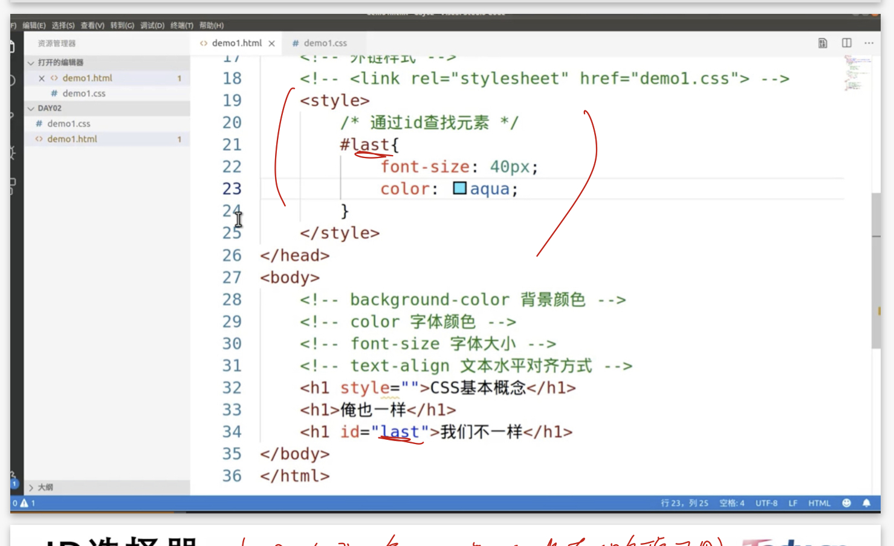

## Section 3

### Html
超文本標記語言
透過元素的形式構建頁面結構並填充內容，元素是一個頁面的核心，也稱為標記或標籤。
使用<>包覆標籤，根據包裹名稱的數量，元素分兩類：
雙標籤 -> 包含開始及結束的標籤 

元素架構：
根元素 html
->
包含 
1. head 元素
    a. body 元素
    b. title 元素

2. body 元素
    a. div
    b. p
    c. div

特殊元素:

< br >
實現換行
 
< hr >
加入水平分割線

- 容器標籤
 
  div是容器標籤，常用於頁面結構的劃分，也能結合css佈局頁面

- 列表標籤
  ul 無序列表 默認使用實心原點
  ol 有序列表，使用數字標示每條數據，可使用start設置值，默認為1

- 列表嵌套
## 
    <ol>
        <li> 
            <ul> 
                <li> 
                </li>
            </ul>
        </li>
    </ol>

- 表格標籤
##
    <table border="1" cellspacing="5">
        <tr>
            <td>班機</td>
            <td>時間</td>
            <td>你好</td>
        </tr>
        <tr>
            <td>班機</td>
            <td>時間</td>
            <td>你好</td>
        </tr>
    </table>

- 表單標籤
  
  表單多用於收集用戶資訊並發給server，由表單標籤及表單控件組成。
  表單標籤form負責提交數據，表單控件負責收集數據，使用form元素。 

  ex:登入數據

##
    <form action="" method="get">
    姓名: <input type="text">
    密碼: <input type="password">
    </form>
屬性說明:
    <table border="1" cellspacing="5">
        <tr>
            <td>屬性名</td>
            <td>取值</td>
        </tr>
        <tr>
            <td>action</td>
            <td>設置數據的提交地址</td>
        </tr>
        <tr>
            <td>method</td>
            <td>設置數據提交方式，默認為get，可設為post</td>
        </tr>
        </tr>
    </table>

以下表單控件屬性可使用

name提交給server的結果會以查詢字符串的方式返回

- 下拉選單
##  
    <form>
        班級：
        <select name="" id="">
            <option>a</option>
            <option>b</option>
            <option>c</option>
        </select>

        <input type="submit">
    </form>

- 圖片標籤
  
  img標籤用於插入圖片，有以下幾個屬性 
  a. src，用於給出圖片的url，必須
  b. width/height
  c. title，圖片標題，鼠標方在圖片上時顯示
  d. alt，設置圖片加載失敗時的提示文

- 超連結標籤
  
  a標籤，點擊後跳轉至其他頁面

  a. href標籤，目標文件url

  b. target，用預設至目標文件打開方式，默認在當前視窗打開，設值target="_blank"會在新窗口打開

- 標籤分類明細

a. 塊標籤: 獨佔一行，不與標籤共行，可手動設置寬高，默認寬度與父標籤保持一致。
  ex body . div , h1~h6 , p ,ul , ol , li , form , table

b. 行內標籤: 可與其他標籤共行顯示，不能手動設置寬高，尺寸由內容決定。ex: span label b strong i s u sub sup a

c. 行內快標籤:可以與其他標籤共同顯示，又能調整寬高。
  ex: img input button (表單控件)

### CSS
CSS 與HTML相輔相成，實現頁面佈局。
使用方式:

- 內聯樣式:
  該樣式用於某元素屬性中，借助於style標籤屬性為當前的標籤添加樣式聲明
## 
    <標籤名 style="樣式聲明">
    style="屬性:值;屬性:值;"
    常用css屬性
    color:red;
    background-color:green;
    font-size:32px;

- 內嵌樣式:
  借助於style標籤，在html文黨中嵌入css樣式code，實現css樣式與html標籤分離，格式如下：
## 
    

    ex:
    

- 外嵌樣式表
優勢：可以透過一個樣式表給多個頁面提供相同樣式

寫法:指定css文件路徑
## 
    <link rel="stylesheet" href="demo1.css">

- CSS選擇器

選擇器語法:
根據標籤名匹配文檔中所有該標。
##
    標籤名{
        屬性:值;
    }

- ID選擇器
  根據標籤中的id屬性值匹配文檔中唯一的標籤。id具備唯一性，不能重複使用。

##
    #id屬性值{
        屬性:值;
    }
ex:

hint:
ID屬性值自定義，可由數字,字母,下滑線,dash組成，不能數字開頭

- class選擇器
  根據標籤屬性的class屬性值匹配相應的標籤，class屬性值可以重複使用，實現樣式復用。

`如果你想指定某特定單一元素的樣式，則應使用 id。`

`若有很多個元素皆有相同樣式，則可使用 class。`

`使用class前面加上. ， id加上#`

- 群組選擇器:
  語法:
##
    selector1,selector2,selector3{
        屬性:值;
    }

- 後代選擇器:
  匹配滿足選擇器的所有後代標籤，包含直接子標籤和間接子標籤。
## 
    selector1 selector2{
        屬性 ：值
    }

上述代表匹配selector1中所有滿足selector2的後代標籤

標籤間關係：
## 
    
祖父標籤
        
父標籤
            子標籤
            
        

    

- 子代選擇器
匹配滿足選擇器的所有直接子標籤
語法格式:
## 
    selector1>selector2{
        屬性:值;
    }

- 偽類選擇器
  
  可以為標籤的不同狀態分別設置樣式，但必須與基礎選擇器結合使用才能生效。
分類：
a. hover 鼠標滑過時的狀態
b. focus 焦點狀態(文本匡被編輯時)

使用：
##  
    .c1:hover{ }
    .txt:focus{ }

### 選擇器優先級
選擇器為標籤設置樣式，發生衝突時看選擇器權重，權重越大優先級越高。

<table border="1" cellspacing="5">
        <tr>
            <td>選擇器</td>
            <td>權重</td>
        </tr>
        <tr>
            <td>標籤選擇器</td>
            <td>1</td>
        </tr>
        <tr>
            <td>(偽)類選擇器</td>
            <td>10</td>
        </tr>
            <td>id 選擇器</td>
            <td>100</td>
        </tr>
        </tr>
            <td>行內樣式</td>
            <td>1000</td>
        </tr>
</table>

